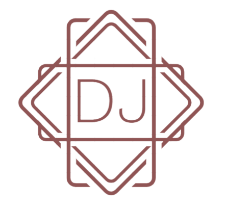
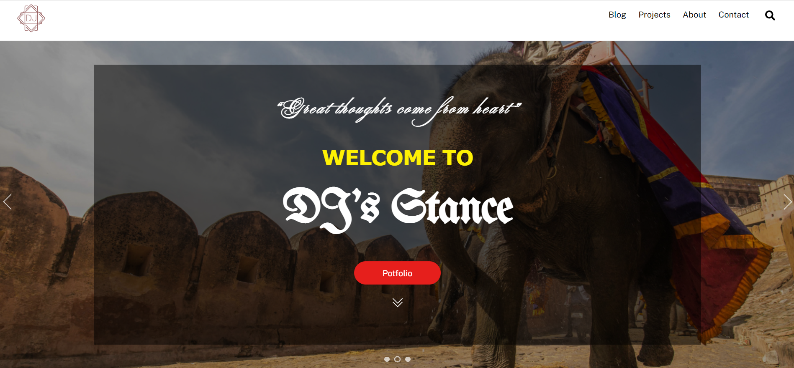

    

<h1 align = "center">Stance DJ</h1>

Wordpress Blogging Website

## Demo
In order to view this project live inaction, click on the link gievn below 
[StanceDJ](http://stancedj.com/)
  

## GUI

  

## Technology Stack
 
Follwing technologies have been used at the core of this application to make it stand in the market place:

- Wordpress
  

## Deployment Details
 
The website is deployed using the hosting provided by <strong>Digital Ocean</strong>

   
  

  
The Domain name is bought from <strong>NameCheap</strong>: 

  

  

  

## Developer
Muhammad Abdullah Butt  
abdullahbutt12292210@gmail.com  
> [Instagram](https://www.instagram.com/abdullah.butt.22/) 
> [FaceBook](https://www.facebook.com/profile.php?id=100076291614529) 
> [YouTube](https://www.youtube.com/channel/UCnuOFQyMywg-KuoN-lmav1Q) 
> [Portfolio](https://rebrand.ly/muhammadabdullahPortfolio) 
> [Website](#)

